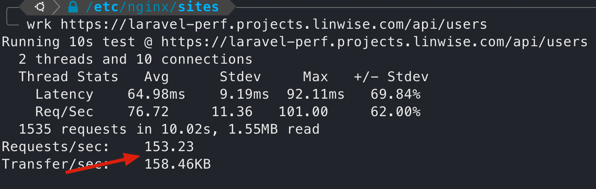
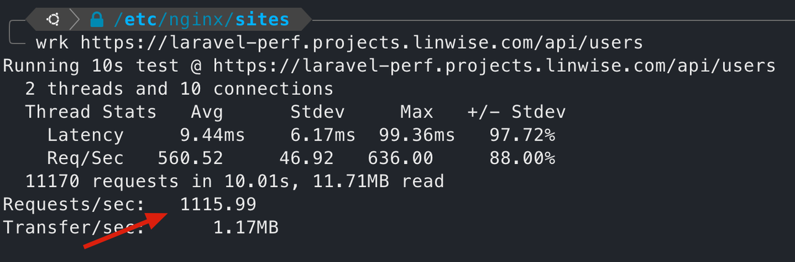
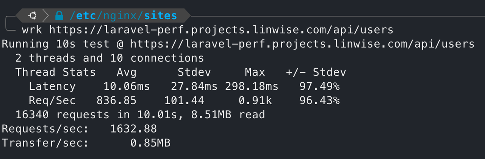
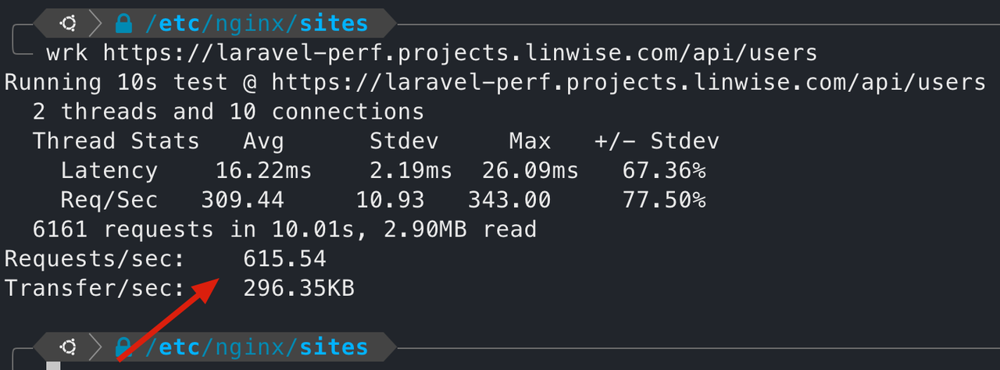

# Simple Laravel Performance Test

> Laravel 12 from https://laravel.com/
>
> App running on 4c8g 20hdd AWS EC2 VPS.
>
> PostgresSQL 16.8 db.
>
> Requests are sent from the same server.

## Screenshots

### get landing page 140+ rps

### get users 150+ rps

### with octane, get users 1100+ rps

### with octane + redis, get users 1600+ rps

### without octane + with redis, get users 600+ rps

## License

The Laravel framework is open-sourced software licensed under the [MIT license](https://opensource.org/licenses/MIT).
